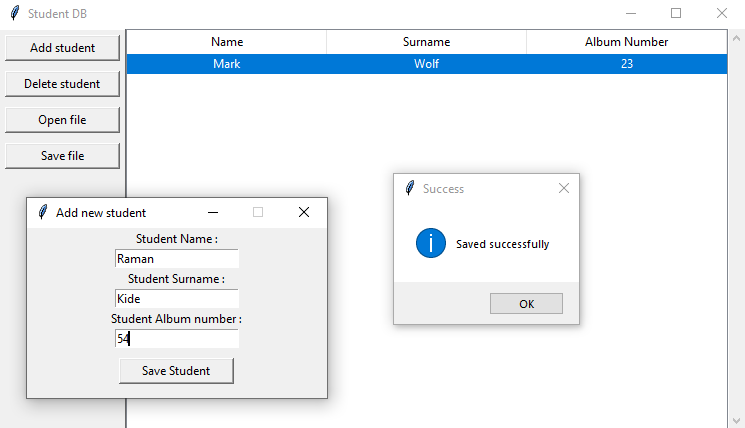

# StudentDB.py

    Program which mimic student database and have the following functionality:
     •  The purpose of the program is to store and manage student data. 
        Store Name, Surname, and album numbers of added students.
     •  GUI
     •  Possibility to add data to the database or delete it (collect data from the user)
     •  Saving and reading data to/from file in .csv format
     •  Display student data in table form

## Screenshot

